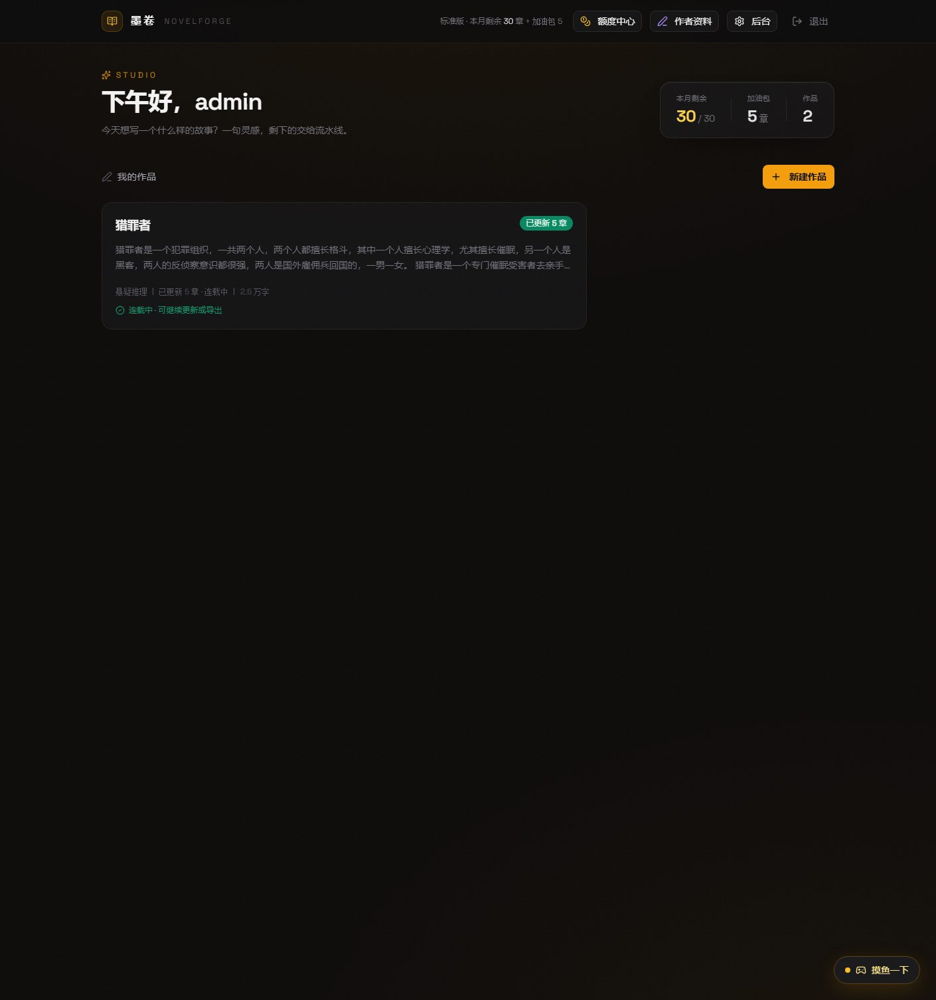
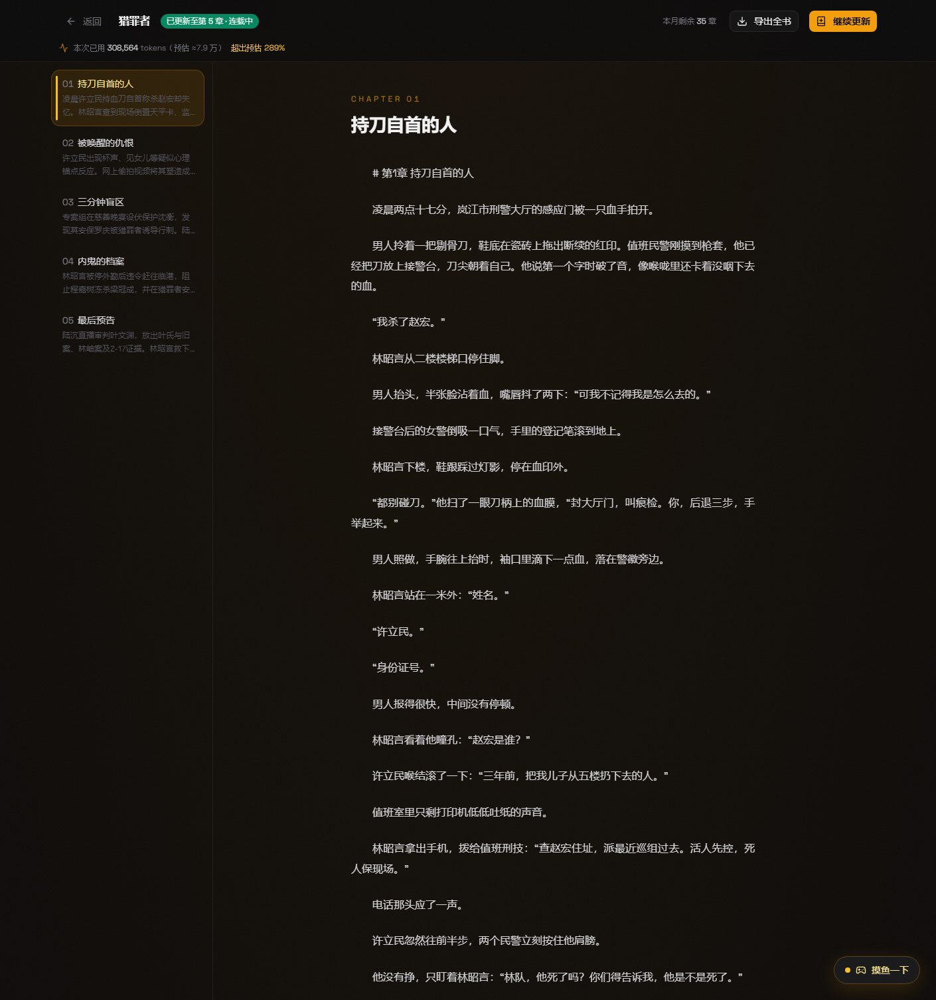
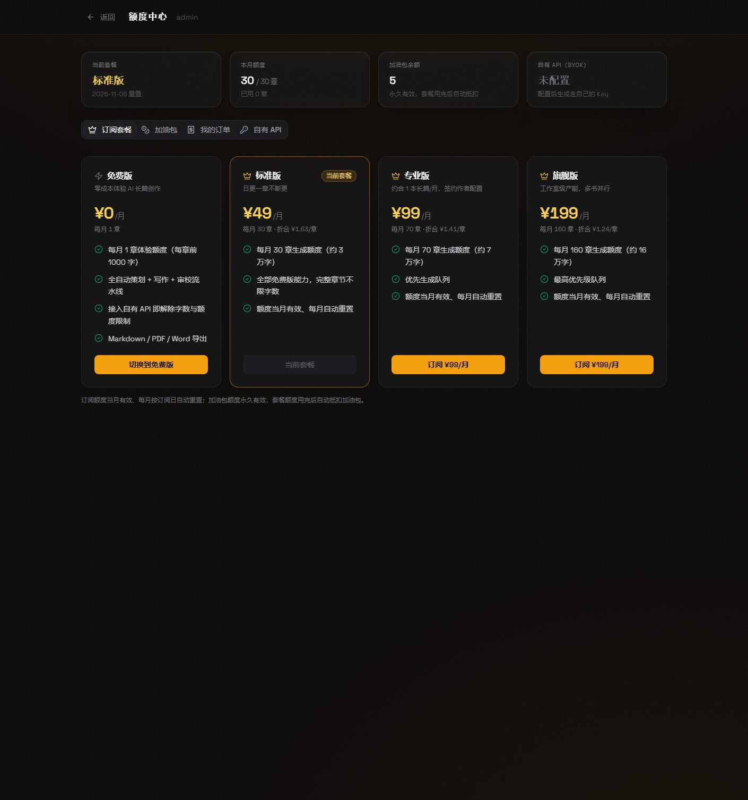

# 墨卷 NovelForge

**接入自己的 API Key，免费 unlimited 生成中文长篇小说的写作平台。**

一句灵感 → 整书策划 → 逐章流式写作 → 审校修订 → 连载续写，全自动多 Agent 流水线。代码全开源，数据（作品与 Key）都握在自己手里。

| 创作台 | 章节阅读器 |
| --- | --- |
|  |  |

| 套餐与加油包 | 接入自有 Key（BYOK） |
| --- | --- |
|  | 额度中心 → 自有 API，粘贴 Key 自动检测可用性 |

## 30 秒上手

**方式一：体验站（免安装，内测中）**

打开 [官方体验站](http://203.195.205.131/) → 输内测码注册 → 额度中心「自有 API」粘一个自己的 Key（DeepSeek / Kimi / OpenAI / 千问……支持自动检测可用性）→ 新建作品，一句话开写。自带 Key 时**生成不限额度、不收任何费用**。

> 内测码：在 GitHub Issues 或社区帖里留言申请，或直接自部署。

**方式二：自部署（完全免费，数据 100% 私有）**

```bash
git clone https://github.com/Allen-Chen-coder/novelforge.git
cd novelforge/novel_platform/frontend
npm install && npm run dev   # 前端 :3000 + 后端 :8787
```

默认账号 `admin / admin123`（首次登录后立即修改）。生产部署（Docker / 宝塔面板 / Nginx）见 [novel_platform/DEPLOY.md](novel_platform/DEPLOY.md)。

## 为什么不是直接拿 ChatGPT / DeepSeek 写小说？

| | 通用聊天框 | 墨卷 NovelForge |
| --- | --- | --- |
| 长篇连续性 | 几千字后失忆、人设崩坏 | 滚动摘要 + 伏笔台账 + 人物小传，逐章严格承接前文 |
| 写作流程 | 一句句挤牙膏 | Planner / Writer / Critic / Reviser / Summarizer / Judge 六角色流水线，策划→写作→审校→修订全自动 |
| 产出形态 | 聊天记录 | 章节书库 + Markdown / PDF / Word 导出，可日更连载 |
| 等待体验 | 盯着转圈 | SSE 流式直播 + 弹幕事件时间线 + 摸鱼坞小游戏 |
| 成本 | 按次付高价 | 自带 Key = 按官方价走，平台侧零加价 |
| 数据 | 存在别人服务器 | 自部署全私有；体验站账号隔离 |

## 核心特性

- **全自动长篇流水线**：世界观与人物策划、章节大纲、正文写作、审校（逻辑/人设/伏笔一致性检查）、自动修订，一条龙；
- **长篇连载模型**：开篇埋长线钩子，「继续更新」逐章日更，已更新章节数 / 总字数 / 最近更新一目了然；
- **流式直播看台**：生成过程逐字推送，弹幕式时间线呈现每个 Agent 的所思所为；
- **个人书库**：每本书独立记忆空间，十章后续写依然承接前文，不另起炉灶；
- **摸鱼坞**：码字挑战、金句盲盒、剧情骰子——生成等待不无聊；
- **Token 预估与计量**：生成前按章数 / 字数 / 逻辑复杂度预估用量，生成后给出实测对比；
- **BYOK 多服务商**：DeepSeek、Kimi（Moonshot）、OpenAI、通义千问、Vectrust 等预设一键填入，粘贴即自动检测 Key 可用性；
- **导出**：Markdown / PDF（带排版美化）/ Word；
- **商业化闭环**（可选启用）：套餐订阅 + 加油包 + 个人收款码人工核销 + 内测码注册 + 管理后台（用户 / 订单 / 用量 / 模型路由）；
- **作者资料**：署名与作品简介服务器存储，导出自动带版权页。

## 仓库结构

| 目录 | 说明 |
| --- | --- |
| `novel_agent/` | 生成引擎：六角色 Agent 流水线、prompt 体系、LLM 适配层（支持流式输出与断点续跑） |
| `novel_platform/` | 平台：FastAPI 后端（认证、额度、订单、计量、SSE）+ React 前端（创作台、阅读器、额度中心、管理后台） |

技术栈：FastAPI · SQLite · React 19 · Vite · Tailwind CSS · SSE。

## 商业化说明

本项目以开源方式发布，自部署永久免费。官方体验站提供托管服务以覆盖服务器与运维成本：

- **自带 API Key 的用户不限额度、免费使用**（模型费用直接付给服务商）；
- 没有 Key 的用户可订阅套餐（¥0 体验版 / ¥49 / ¥99 / ¥199）或购买加油包，由平台 Key 代生成；
- 收款采用站长个人收款码 + 后台人工核实到账，接入微信/支付宝商户后可切换自动回调（`payments/` 已留好接口）。

## License

代码开源，欢迎 star 和 PR。自部署随意使用；如需在自己的站点商用，请替换 `frontend/public/pay/` 下的收款码与相关品牌信息。
